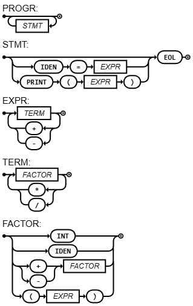

# Haskllite

Haskllite is a lightweight, educational programming language inspired by Rust's syntax, implemented in Haskell. It serves as a simplified subset designed to demonstrate core compiler concepts including lexical analysis, parsing, and AST interpretation.

[](https://compiler-tester.insper-comp.com.br/svg/marcelopenas/haskllite)

## Features

* **Functions:** Declaration support with parameters and explicit return types.
* **Variable Binding:** Logic for `let` (immutable) and `let mut` (mutable) bindings.
* **Strong Typing:** Native support for `i32`, `f64`, `bool`, and `str`.
* **Type Casting:** Explicit and implicit type casting capabilities.
* **Control Flow:** Native `if/else` logic, `while` loops, and C-style `for` loops.
* **Ternary Assignment:** Support for `if/else` expressions during variable assignment.
* **I/O Operations:** Basic `println!()` and `scanln!()` macros.
* **Error Reporting:** Descriptive compilation error messages featuring type info and formatted code snippets showing the error location.

> **Compatibility Note:** While Haskllite mimics Rust syntax, it is a simplified subset. It does not include a borrow checker, ownership system, or complex lifetimes.

## Running

Ensure you have [Glasgow Haskell Compiler (GHC)](https://www.haskell.org/ghc/) installed.

You can run the project in two ways: Interpreted or Compiled.

### Using the compiler

You can either compile or run wih the haskell interpreter

#### Compile

THis will produce a `haskllite` binary file that can be used to compile `.rs` sources

    ./compile.sh

#### Interpret

Use this instead of `haskllite` binary if you wish to use the haskell interpreter

    runghc ./main.hs

### Interpreted Mode

For quick testing without pre-compilation

    ./haskllite ./path_to_source.rs

### Compiled Mode

This will produce a binary file with the same name that can be executed

    bash compile.sh ./path_to_source.rs

### Example code

```rust
fn main() {
    println!("Haskllite")
    let mut x: i32 = 10;
    while (x > 0) {
        println!(x);
        x = x - 1;
    }
    let y: f64 = 4.2;
    let mut z: str = (str) y;

    println!(z + scanln!());
}
```

## Architecture

The project follows a standard compiler pipeline:

1. Lexer: Tokenizes the raw input string.

2. Parser: Recursive descent parser based on the EBNF below.

3. AST: Generates an Abstract Syntax Tree representing the program.

4. Interpreter: Traverses the AST to execute the logic in Haskell.

## Grammar specifications

### EBNF

The formal grammar for Haskllite is defined as:

```ebnf
(* High-Level Structure *)
PROGRAM     = { FUNC | STMT } ;

FUNC        = "fn", IDENTIFIER, "(", [ ARGS ], ")", [ "->", ( TYPE | "()" ) ], BLOCK ;

ARGS        = IDENTIFIER, ":", TYPE, { ",", IDENTIFIER, ":", TYPE } ;

BLOCK       = "{", { STMT }, "}" ;

(* Statements *)
STMT        = [ "let", [ "mut" ], IDENTIFIER, ":", TYPE, [ "=", BEXPR ]
              | IDENTIFIER, ( "=" , BEXPR | "(", [ BEXPR, { ",", BEXPR } ], ")" )
              | "println!", "(", BEXPR, ")" 
              | "while", "(", BEXPR, ")", STMT 
              | "for", "(", ASSIGNMENT, ";", BEXPR, ";", ASSIGNMENT, ")", BLOCK
              | "if", "(", BEXPR, ")", STMT, [ "else", STMT ] 
              | "return", BEXPR 
              | BLOCK 
              ], ";" ;

ASSIGNMENT  = IDENTIFIER, "=", BEXPR ;

(* Expression Hierarchy (Precedence) *)
BEXPR       = BTERM, { "||", BTERM } ;
BTERM       = REXPR, { "&&", REXPR } ;
REXPR       = EXPR,  { ("==" | ">" | "<"), EXPR } ;
EXPR        = TERM,  { ("+" | "-" | "^"), TERM } ;
TERM        = POWER, { ("*" | "/"), POWER } ;
POWER       = FACTOR, { "**", FACTOR } ;

FACTOR      = INTEGER 
            | BOOL 
            | STR 
            | CALL 
            | IDENTIFIER 
            | ( "+" | "-" | "!" ), FACTOR 
            | "(", BEXPR, ")" 
            | "scanln!", "(", ")" ;

(* Lexical Tokens *)
TYPE        = "str" | "i32" | "f64" | "bool" ;
BOOL        = "true" | "false" ;
STR         = '"', { '\"' | ANY - '"' }, '"' ;
IDENTIFIER  = LETTER, { LETTER | DIGIT | "_" } ;
INTEGER     = DIGIT, { DIGIT } ;
LETTER      = "a" | "b" | "..." | "z" | "A" | "B" | "..." | "Z" ;
DIGIT       = "0" | "1" | "..." | "9" ;
```

### Syntactic diagram


